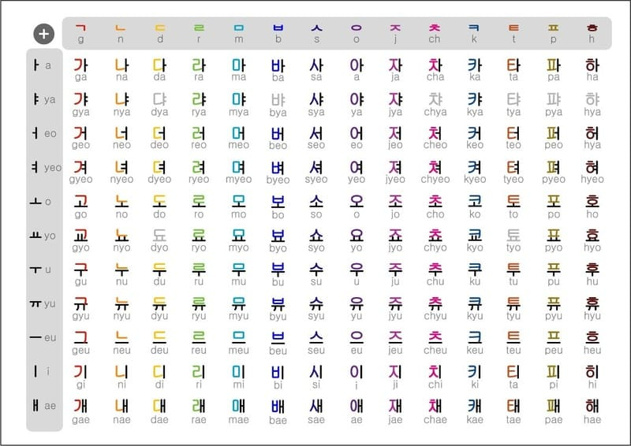

## Giới thiệu

Học tiếng Hàn để xem K-drama mà không cần phụ đề, đọc webtoon và tiểu thuyết, hoặc giao tiếp với người Hàn đều đòi hỏi những kỹ năng nền tảng giống nhau: khả năng hiểu tiếng Hàn tự nhiên thông qua việc đọc và nghe. Hướng dẫn học này được viết để cung cấp cho bạn một cái nhìn tổng quan về cách bắt đầu xây dựng các kĩ năng trên. Phần còn lại phụ thuộc vào bạn.

## Hệ thống chữ viết tiếng Hàn

Trước khi bắt đầu học một ngôn ngữ mới nào đó, việc đầu tiên mà bạn cần làm đó chính là học bảng chữ cái và cách phát âm. Đối với ngôn ngữ Hàn, quốc gia này sử dụng bảng chữ cái Hangul (bao gồm 21 nguyên âm và 19 phụ âm). Hangul bao gồm 24 chữ cái cơ bản (14 phụ âm và 10 nguyên âm), được kết hợp thành các khối âm tiết. Mỗi khối thường đại diện cho một âm tiết và bao gồm 2-3 chữ cái.

Học Hangul nên là mục tiêu đầu tiên của bạn. Bạn có thể học cách đọc và viết Hangul trong vài giờ đến vài ngày. Không có lý do gì để trì hoãn bước này. Hãy luyện đọc và viết Hangul bằng tay hoặc sử dụng các ứng dụng. Đừng lo về từ vựng vội – chỉ cần đảm bảo bạn nhận diện và phát âm chính xác từng âm tiết.

Xem [video hướng dẫn bảng chữ cái tiếng Hàn](https://www.youtube.com/watch?v=EOf7Rp_mSBM).
Sau khi học xong bạn cũng có thể tự kiểm tra thông qua [Hangul Quiz](https://joakimostm.github.io/hangul-quiz/)

Hangul là đủ để bắt đầu đọc tiếng Hàn. Tuy nhiên, nhiều từ tiếng Hàn bắt nguồn từ tiếng Hán (Hanja). Bạn không cần học Hanja để hiểu tiếng Hàn, nhưng việc học các từ Hanja phổ biến có thể giúp phân biệt các từ đồng nghĩa hoặc hiểu gốc từ Hán-Hàn.

!!! warning "Lưu ý khi viết"
    Bạn không nên viết Tiếng Hàn bằng chữ cái Latin (Kiểu a, b, c ấy)

## Học tiếng Hàn

### Ngữ pháp

Học ngữ pháp khá đơn giản: Chọn một hướng dẫn ngữ pháp và học từ cái hướng dẫn đấy. Dưới đây là một số hướng dẫn ngữ pháp (Được sắp xếp theo thứ tự ưu tiên):

- [Ngữ Pháp Tiếng Hàn - Bomi](https://bomi.vn/hoc-tieng-han-quoc/ngu-phap-tieng-han/)
- [하여 Ngữ Pháp Tiếng Hàn](https://www.tuhoctienghan.vn/ngu-phap/)
- [Ngữ pháp Tiếng Hàn - MasterKorean](https://blog.masterkorean.vn/ngu-phap)
- [Ngữ pháp - Tiếng Hàn Thầy Tư](https://tienghanthaytu.com/category/ngu-phap/)

Đừng kỳ vọng sẽ nhớ hết mọi thứ ngay từ lần đầu đọc, nhưng bạn nên cố gắng hiểu nội dung. Mục tiêu của tài liệu ngữ pháp không phải là giúp bạn "thành thạo" ngôn ngữ (điều này chỉ đạt được qua nhiều luyện tập và tiếp xúc), mà là giới thiệu các kiến thức cơ bản và cung cấp nền tảng để bạn bắt đầu đọc tài liệu tiếng Hàn gốc.

Sau khi "học xong" ngữ pháp, bạn có thể bắt đầu đọc sách hoặc các thứ bằng tiếng Hàn, đồng thời tham khảo lại tài liệu để củng cố kiến thức. Khi đọc tiếng Hàn, bạn đang thực hành ngữ pháp liên tục vì bạn sử dụng nó để hiểu nội dung. Đây không phải là điểm kết thúc của việc học ngữ pháp. Hướng dẫn ngữ pháp chỉ bao gồm các kiến thức cơ bản.

### Từ vựng

[Anki](http://apps.ankiweb.net/) là một chương trình flashcard giúp bạn học từ vựng thông qua phương pháp [lặp lại ngắt quãng](https://en.wikipedia.org/wiki/Spaced_repetition). Bạn có thể sử dụng 3 bộ thẻ từ vựng Anki này:

- [Tiếng Hàn Tổng Hợp 1](https://ankiweb.net/shared/info/1829052615)
- [Tiếng Hàn Tổng Hợp 2](https://ankiweb.net/shared/info/322575033)
- [Tiếng Hàn Tổng Hợp 3](https://ankiweb.net/shared/info/1893954422)

Sau khi hoàn thành các bộ thẻ từ vựng, bạn sẽ nhận ra phần lớn từ trong một câu, nhưng vẫn cần tra cứu nhiều từ trên mỗi trang.

Sau khi hoàn thành các bộ thẻ trên (hoặc bỏ qua nó), một số người bắt đầu tạo “bộ từ tự chọn” (mining deck). Đây là bộ từ vựng bạn tự xây dựng bằng cách thêm các từ mới gặp khi immerse. Tiện ích trình duyệt [Yomitan](https://yomitan.wiki) giúp đơn giản hóa việc này: chỉ cần di chuột qua từ và nhấp vào nút “+” để thêm từ vào bộ từ.

## Tóm lại là học như thế nào?

1. Học Hangul. Luyện viết và phát âm từng âm tiết.
2. Học 3 bộ thẻ Anki ở trên. Có thể cài đặt thêm [Yomitan](https://yomitan.wiki) (Firefox/Chrome) để tra từ bằng cách di chuột.
3. Vì bạn sẽ học từ vựng song song với ngữ pháp, hãy điều chỉnh tốc độ học phù hợp. Điều này không có nghĩa là bạn không nên thử thách bản thân. Trong Anki, bạn có thể thay đổi số lượng thẻ mới mỗi ngày, nhưng hãy giữ mức mặc định trong vài ngày đầu để xem nó phù hợp ra sao. Tăng số thẻ nếu bạn thấy còn dư sức, hoặc giảm nếu cảm thấy quá tải (hoặc thử thách bản thân hơn). Khi đã quen, số thẻ cần ôn lại mỗi ngày sẽ gấp khoảng 10 lần số thẻ mới (ví dụ: 20 thẻ mới/ngày tương đương 200 thẻ ôn/ngày). Đặt giới hạn ôn tập hàng ngày ở mức cao nhất trong tùy chọn bộ thẻ, vì việc không hoàn thành ôn tập đúng hạn sẽ ảnh hưởng đến hệ thống lặp lại ngắt quãng của Anki. Nếu khó theo kịp, hãy giảm số thẻ mới thay vì giới hạn ôn tập.
4. Để học ngữ pháp.
5. Sau khi học xong hướng dẫn ngữ pháp, bạn đã sẵn sàng để đọc tiếng Hàn. Mặc dù không bắt buộc, việc đọc sẽ dễ hơn nếu bạn biết khoảng 1000–2000 từ vựng (thông qua các bộ thẻ Anki)
6. Ở giai đoạn này, nhiều người bắt đầu tạo bộ từ tự chọn (mining deck). Đây là bộ từ vựng mà bạn thêm các từ mới mà bạn học được thông qua quá trình immersion. Bạn nên sử dụng [tích hợp Yomitan với Anki](https://yomitan.wiki), cho phép tạo thẻ Anki mới chỉ với một cú nhấp chuột ([hướng dẫn](https://yomitan.wiki/anki)).
8. Đọc nhiều hơn. Ban đầu bạn sẽ đọc chậm, nhưng càng luyện tập bạn sẽ càng tiến bộ.
9. Thưởng thức các nội dung hấp dẫn.

## Câu hỏi

### Học tiếng Hàn có lâu không?

Lâu phết đấy.

Một số người cho rằng nếu học đều đặn, bạn có thể trở nên thành thạo trong 4 năm. Suy nghĩ theo kiểu “tôi có 4 năm để thông thạo” sẽ giúp bạn tránh sai lầm phổ biến của người mới: học vội vàng, quá sức và bỏ cuộc vì tư duy ngắn hạn (ví dụ: đặt giới hạn 100 thẻ mới/ngày trong Anki vì nghĩ học chậm quá, rồi bị quá tải sau một tuần và bỏ cuộc).

### Sử dụng Google để học tiếng Hàn:

Đặt tìm kiếm trên [google.co.kr](https://www.google.co.kr/) để có kết quả tốt hơn nhiều.

Dưới đây là phiên bản điều chỉnh cho phù hợp với người học tiếng Hàn, giữ nguyên tinh thần nhưng chuyển sang ví dụ và cú pháp tiếng Hàn:

### Mình không hiểu nghĩa của từ này

Hãy thử tìm trên Google các cụm như:

* `X 뜻`
* `X란`
* `X라는 말`
* `X 의미`
  trong đó **X** là từ bạn muốn tra nghĩa.
  Các cụm như `X 무슨 뜻`, `X의 의미` cũng thường cho kết quả tốt.

> Ví dụ: nếu bạn không hiểu từ "가치관", bạn có thể tìm `가치관 뜻` hoặc `가치관란`.
### Sự khác biệt giữa X và Y là gì?

Bạn có thể tìm trên Google các cụm như:

* `X와 Y의 차이`
* `"X" "Y" "차이"`
* `X와 Y 차이점`

Nếu kết quả hiện ra khiến bạn thấy khó hiểu, có thể là vì bạn chưa đủ trình độ tiếng Hàn để lo về sự khác biệt giữa X và Y — cứ tiếp tục học thêm đã rồi quay lại sau nha.

> Ví dụ: muốn phân biệt "감정" và "기분", hãy tìm `감정과 기분의 차이`.

### Khi nào nên bắt đầu đọc?

Bạn có thể bắt đầu đọc ngay khi hoàn thành một hướng dẫn ngữ pháp. Việc đọc sẽ dễ hơn nếu bạn biết khoảng 1000–2000 từ, nhưng không nên trì hoãn quá mức này. Lần đầu đọc sẽ khó dù bạn biết bao nhiêu từ.