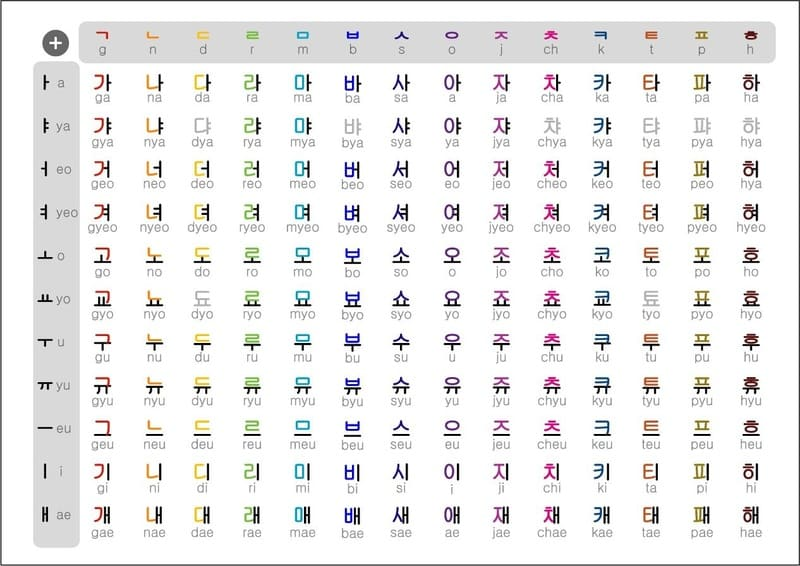
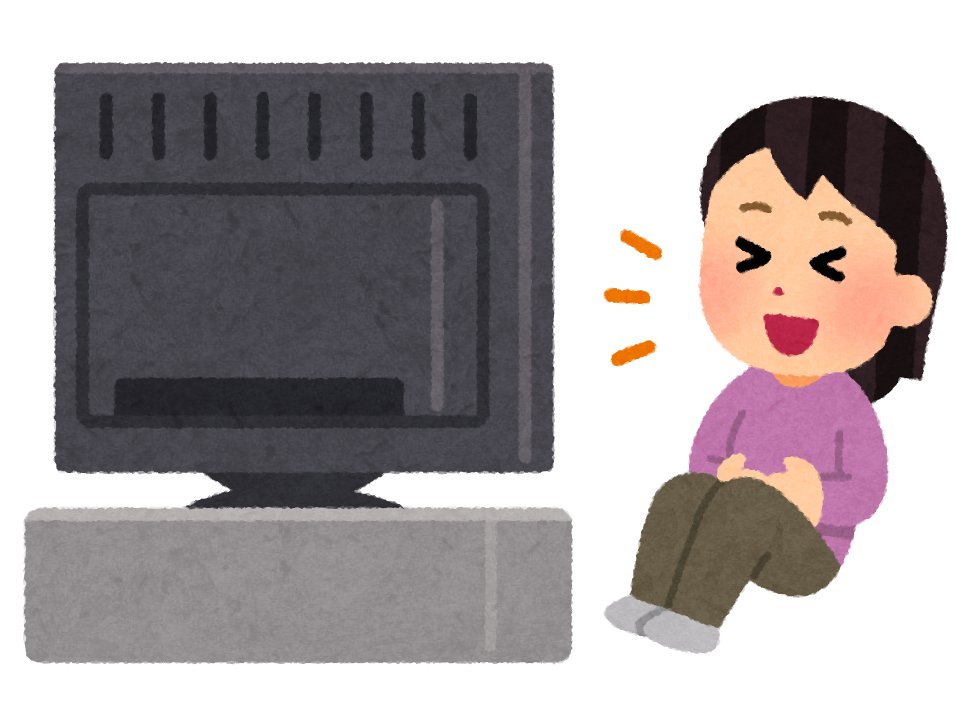
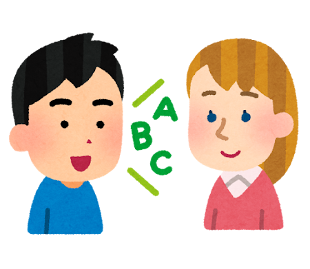

# Một hướng dẫn tự học Tiếng Hàn

_Nếu bạn không cần đọc phần mở đầu, hãy đến luôn phần **[Cách để học Tiếng Hàn](#21-cach-hoc-tieng-han)**._

Bạn đã bao giờ gặp một bạn bất kì nói Tiếng Hàn như gió và hỏi nó học kiểu gì thì nó bảo là nó xem K-drama chưa? Hướng dẫn này sẽ đi sâu hơn vào cách học đó thay vì chỉ bảo bạn là "tao học Tiếng Hàn qua phim, youtube này kia".

## 1.1 Nhiều người học ngoại ngữ "thất bại" do đâu?

Có một số lượng không nhỏ những người bắt đầu học Tiếng Hàn để có thể trải nghiệm nội dung bằng Tiếng Hàn hoặc để có thể nói Tiếng Hàn trôi chảy. Dù vậy, không ít người sau nhiều năm học vẫn không thể đạt được mục tiêu ấy. Có phải do việc học ngoại ngữ quá khó? Hay do chưa đủ chăm?

Có lẽ vấn đề không phải nằm ở những người học ấy, mà là ở phương pháp. Trong việc học ngôn ngữ, phương pháp học của bạn tạo ra sự khác biệt rất lớn trong khả năng và tốc độ tiến bộ ngoại ngữ của bạn.

Khó có thể đạt được những mục tiêu như vậy nếu chỉ học bằng các phương pháp học ngoại ngữ truyền thống. Nhiều người "thất bại" vì không thực hiện immersion trong quá trình học.

**Immersion** để chỉ việc nghe hoặc đọc nội dung Tiếng Hàn, ví dụ như là xem Going Seventeen không có phụ đề Tiếng Việt (Hay bất kì phụ đề gì ngoài Tiếng Hàn) chẳng hạn.

## 1.2 Vấn đề của phương pháp học truyền thống

{: style="display: block; margin: 0 auto; max-width:40%; height:auto;" }

Học ngoại ngữ theo phương pháp "truyền thống" thì thường sẽ kiểu như này:

- Học các câu cơ bản như câu chào hỏi, tự giới thiệu.
- Học cấu trúc ngữ pháp và từ vựng cơ bản.
- Nghĩ ra câu bằng cách trò chuyện với giáo viên hoặc bạn học hoặc bằng cách viết.
- Dịch các câu ví dụ từ Tiếng Việt sang ngôn ngữ đích (TL - Target Language) và ngược lại.
- Tra cứu thêm tài liệu về cấu trúc ngữ pháp và từ vựng trong sách giáo khoa hoặc xem video YouTube
- Thực hành hội thoại sử dụng kiến thức đã học.
- Tích lũy thêm nhiều cấu trúc từ vựng và ngữ pháp và lấy số lượng làm thước đo cho sự tiến bộ của bản thân
- Và cuối cùng là đến giai đoạn cuối, chuyển đến sống hoặc đi du lịch các nước nói Tiếng Hàn với hy vọng có cơ hội rèn luyện kỹ năng của mình.

Bản thân việc học như này hoàn toàn ổn, nhưng chưa đủ để giúp bạn đạt được trình độ cao. Vấn đề là những người học thuộc nhóm trên không tương tác với ngôn ngữ thực tế.

Lấy bơi lội làm ví dụ: Bạn không thể chỉ mãi ở bể bơi dành cho trẻ con, đeo phao và hy vọng rằng mình sẽ thành thạo kỹ thuật bơi ở đó trước khi bước ra bể lớn. Làm như vậy sẽ không bao giờ khiến bạn trở thành một người biết bơi thực thụ. Cũng giống như bạn không thể trở thành vận động viên bơi lội chỉ bằng cách học lý thuyết và luyện động tác trên cạn, mà không bao giờ nhảy xuống nước thật.

  Điều quan trọng là: phải học cách tiếp tục, kể cả khi bạn không hiểu nhiều.

Người mới học thường mắc một cái bẫy là cố gắng học lý thuyết (kiểu như ngữ pháp hay là nhồi từ vựng) cho đến khi hiểu hết mới thôi và không immerse vì chưa cảm thấy thoải mái hay _sẵn sàng_. Tuy nhiên, cần ngừng sử dụng tài liệu cho người mới học càng sớm càng tốt vì trên thực tế, bạn sẽ không bao giờ cảm thấy sẵn sàng nếu không bắt đầu tiếp xúc với ngôn ngữ thực tế và làm quen với nó.

Chủ nghĩa cầu toàn có thể là con dao hai lưỡi trong việc học ngôn ngữ. Tốn quá nhiều thời gian và công sức mà không đạt được nhiều kết quả, cố ghi nhớ từng chi tiết nhỏ nhất của những thứ không thực sự quan trọng trong cả quá trình học dài đấy.

Học một ngôn ngữ giống như leo núi vậy. Bạn có thể cố gắng leo mà không dùng đến bất kỳ công cụ hỗ trợ nào – và dù sẽ rất vất vả, nếu kiên trì, bạn vẫn có thể đến đích. Việc học theo cách truyền thống giống như đang chuẩn bị dây thừng để có thể leo núi dễ hơn. Nhưng bạn không thể chỉ ngồi đó chuẩn bị dây mãi – đến một lúc nào đó, bạn sẽ phải bắt đầu leo. Dù bạn có làm ra bao nhiêu dây đi nữa, thì việc leo núi vẫn sẽ khó khăn và tốn thời gian. Không có đường tắt – bạn phải thực sự bắt tay vào _thực hiện_.

## 1.3 Quy mô của ngôn ngữ

Ngôn ngữ thực sự quá rộng lớn. Có quá nhiều thứ vượt xa ranh giới trong một lớp học hoặc phương pháp dạy theo kiểu "x có nghĩa là y" (A is B) hoặc "x thực hiện hành động y" (A does B). Để thành thạo một ngôn ngữ ở cấp độ cao cần một lượng lớn "đọc" và "nghe" nội dung ngôn ngữ đích.

Và thường thì rất khó để hiểu tại sao họ lại dùng _câu đó_ trong _tình huống kia_, hay _từ này_ thay vì _từ kia_. Điều đó tạo nên một rào cản lớn cho người học – bởi vì bạn không thể chỉ học mỗi ngữ pháp và từ vựng mà mong nói được như người bản xứ.

Nếu không có những trải nghiệm cần thiết, việc cố gắng tự tạo câu ở ngôn ngữ mục tiêu thường khiến cho cách diễn đạt trở lên thiếu tự nhiên hoặc khó hiểu. Thêm nữa, việc không hiểu hoặc chưa hiểu rõ cách người bản ngữ sử dụng ngôn ngữ của họ khiến việc hiểu họ trở nên khó khăn hơn rất nhiều do không quen với cách diễn đạt bên ngoài phạm vi của tài liệu học tập.

Đây là lý do tại sao trong việc học ngoại ngữ cần có **"immersion" - đọc và nghe những gì người bản ngữ viết và nói.**

Học ngôn ngữ là một quá trình ghi nhớ các pattern (mẫu) trong vô thức thông qua comprehensible input (đầu vào dễ hiểu - nghe và đọc nội dung dễ hiểu với trình độ tương ứng của bạn). Điều này có nghĩa là, khi bạn hiểu điều gì đó (comprehensible) trong quá trình immersion, bộ não của bạn sẽ vô thức lưu mẫu (pattern) đó vào trong đầu để có thể sử dụng trong tương lai. Nó sẽ kiểu như: "Ê mày, có mẫu số 234 được sử dụng với mẫu số 82 và mẫu số 10 kìa".

Tại sao lại không nói về "biết ngữ pháp" hay "nhớ từ vựng"? Bởi đây không phải là cách xử lý ngôn ngữ tự nhiên. Một số người không phải là người bản ngữ Tiếng Hàn và có thể là đã học ngữ pháp Tiếng Hàn từ trước, nhưng họ sẽ chẳng mấy khi nghĩ về các cấu trúc ngữ pháp khi tương tác với Tiếng Hàn hàng ngày.

## 1.4 Chấp nhận cảm giác khó chịu và mù mờ

{: style="display: block; margin: 0 auto; max-width:40%; height:auto;" }

Trong việc học ngôn ngữ hay trong bất cứ lĩnh vực nào đòi hỏi kỹ năng, bạn sẽ luôn gặp khó khăn trong một thời gian dài cho đến khi bạn tiến bộ hơn. Như đã nói ở trên, nhiều người học (mình cũng đã từng như vậy) cứ cố gắng học thật tốt một thứ gì đó trước khi sử dụng chúng trong thực tế.

Ví dụ, một người học khi cố học một cấu trúc ngữ pháp nào đó quá lâu và không chuyển sang những nội dung khác mà họ nên học.

<h3>↑ Đây là điều chúng ta cần tránh</h3 >  

Không dễ dàng gì để có thể hiểu hết quyển tiểu thuyết hay một bộ phim ngay lần đầu. Cần tới lần thứ ba, thứ tư, thứ năm và thậm chí thứ sáu để có thể học được điều gì đó.

## 1.5 "Immersion" là cái gì?

Immersion là khi bạn tương tác với nội dung tự nhiên bằng ngôn ngữ mục tiêu (ở đây là Tiếng Hàn). Là nội dung KHÔNG hề được làm hoặc chọn lọc kỹ càng cho người học mà được làm bởi chính người bản ngữ cho người bản ngữ.

Việc xem một video Tiếng Hàn bất kì trên Youtube, chẳng hạn như [[GOING SEVENTEEN] EP.128 MC 부격돌 : 위험한 초대 #1](https://www.youtube.com/watch?v=27FE8Brbfzs), sẽ được tính là bạn đang "immerse Tiếng Hàn", bởi vì hướng dẫn này không hề được đơn giản hóa hay giúp cho người học Tiếng Hàn. Nó được viết cho những người nói Tiếng Hàn ở mức độ bản ngữ/thành thạo. Vì vậy, khi bạn nghe hoặc đọc nội dung Tiếng Hàn mà người Anh, Mỹ cũng xem là bạn đang thực hành immersion.

Theo thuật ngữ thì được gọi là _input_, nhưng mình thích dùng _immersion_ hơn.

## 1.6 Cách tiếp cận "từ trên xuống" (top-down) trong việc học ngôn ngữ

Việc học một ngôn ngữ yêu cầu bạn phải hài lòng với việc không hiểu tất cả mọi thứ.

Điều này hoàn toàn khác so với cách học ở trường lớp, nơi chủ nghĩa hoàn hảo được tuyên dương dựa trên thành tích học và được xếp loại thông qua các tiêu chí hoặc các kỳ thi.

Những người học ở trên dễ cảm thấy nản vì không hiểu được tất cả hoặc phần nhiều khi tương tác với ngôn ngữ thực tế, cho dù đó là một bộ phim truyền hình, hay một quyển sách hoặc thậm chí chỉ là một cuộc hội thoại bình thường với người bản ngữ. Việc tiếp tục như vậy khi bạn hiểu rất ít nghe có vẻ không hợp lí, nhưng như đã nói ở các phần trước, học một ngôn ngữ cũng giống như nhảy vào hố sâu bất tận vậy.

Điều khiến việc học ngôn ngữ trở nên quá đỗi khác biệt so với các môn học ở trường là nó dựa trên việc sử dụng ngôn ngữ một cách tự nhiên và thực tế, thứ mà tài liệu học tập không thể truyền tải được. Vì vậy, cách duy nhất để làm quen với mọi thứ là chấp nhận sự mù mờ (low comprehension - độ hiểu thấp), vì càng tương tác với ngôn ngữ nhiều thì sẽ càng tiến bộ hơn.

Tất nhiên, chúng ta không _chỉ_ thực hiện immersion mà không làm gì khác. Cũng cần học những thứ như ngữ pháp và từ vựng. Đồng thời, sử dụng từ điển để học từ trong quá trình immersion.

## 2.1 Cách học Tiếng Hàn

### Quá trình học tập ban đầu

Quá trình học tập mở đầu bao gồm bao gồm:

- Làm quen với Tiếng Hàn.
- Học từ vựng cơ bản sử dụng _Anki_.
- Học ngữ pháp thông qua một danh sách phát trên _YouTube_.
- Bắt đầu immerse với comprehensible input cường độ cao. Đây là nhiệm vụ mà bạn cần dành phần lớn thời gian.

### 한글 (Hangul)

한글 (Hangul) là bảng chữ cái tiếng Hàn. Bạn **bắt buộc** phải học Hangul.

Xem [video hướng dẫn bảng chữ cái tiếng Hàn](https://www.youtube.com/watch?v=EOf7Rp_mSBM).
Sau khi học xong bạn cũng có thể tự kiểm tra thông qua [Hangul Quiz](https://joakimostm.github.io/hangul-quiz/)

Hangul là đủ để bắt đầu đọc tiếng Hàn. Tuy nhiên, nhiều từ tiếng Hàn bắt nguồn từ tiếng Hán (Hanja). Bạn không cần học Hanja để hiểu tiếng Hàn, nhưng việc học các từ Hanja phổ biến có thể giúp phân biệt các từ đồng nghĩa hoặc hiểu gốc từ Hán-Hàn.

Bạn cũng nên học (hoặc ít nhất là làm quen) với 받침 (Batchim). Đây về cơ bản là các quy tắc biến đổi âm.
Ví dụ: 막내 (mak-nae) được phát âm giống như 망내 (mang-nae) mặc dù có phụ âm cuối là ㄱ.
Bạn không cần phải ghi nhớ toàn bộ Batchim ngay lập tức, vì bạn sẽ dần hiểu chúng khi nghe ngày càng nhiều tiếng Hàn trong quá trình học. Có rất nhiều video về Batchim từ các YouTuber khác nhau: (sẽ bổ sung sau)

### Xây dựng nền tảng

Trước khi bắt đầu thực hành immersion (hoặc ngay lúc bắt đầu immersion cũng được), bạn nên xây dựng một nền tảng cơ bản về tiếng Hàn. Tuy nhiên, điều quan trọng là phải hiểu rằng "nền tảng" không có nghĩa là hoàn thành toàn bộ giáo trình sơ cấp hay ghi nhớ hàng trăm cấu trúc ngữ pháp trước khi được phép đọc hoặc nghe nội dung thực tế. Mục tiêu của giai đoạn này chỉ là trang bị đủ kiến thức để việc immersion trở nên bớt khó khăn và ít gây nản lòng hơn.

Về ngữ pháp, bạn nên làm quen với những cấu trúc xuất hiện thường xuyên nhất trong tiếng Hàn. Những trợ từ như 은/는, 이/가, 을/를, 에 và 에서 sẽ xuất hiện gần như ở mọi nơi, từ hội thoại hàng ngày cho đến sách báo và video trên YouTube. Bên cạnh đó, các liên kết câu đơn giản như 고, các đuôi lịch sự như 아/어 요 và các dạng quá khứ như 았/었어요 cũng là những cấu trúc nền tảng mà bạn sẽ gặp liên tục trong quá trình đọc và nghe. Bạn không cần phải thuộc lòng mọi quy tắc hay ngoại lệ. Chỉ cần hiểu chức năng cơ bản của chúng và có thể nhận ra khi chúng xuất hiện trong câu là đủ.

Song song với ngữ pháp, hãy bắt đầu xây dựng vốn từ vựng cơ bản. Thay vì học những danh sách từ ngẫu nhiên, hãy ưu tiên những từ xuất hiện thường xuyên trong đời sống hàng ngày như động từ phổ biến, tính từ cơ bản, đại từ, số đếm và những danh từ quen thuộc liên quan đến gia đình, trường học, công việc hoặc các hoạt động thường nhật. Một vài trăm từ thông dụng đầu tiên sẽ giúp bạn hiểu được nhiều nội dung hơn bạn nghĩ và tạo nền tảng để tiếp tục mở rộng vốn từ thông qua immersion.

Điều quan trọng cần nhớ là nền tảng không phải là đích đến. Đây chỉ là bước chuẩn bị để bạn có thể bắt đầu tiếp xúc với tiếng Hàn thực tế càng sớm càng tốt. Nếu bạn dành quá nhiều thời gian để cố gắng "học đủ" trước khi đọc hoặc nghe, bạn sẽ rơi vào cái bẫy chuẩn bị vô tận. Không ai cảm thấy hoàn toàn sẵn sàng trước khi bắt đầu immersion, và đó là điều bình thường.

*Phần lớn khả năng tiếng Hàn của bạn sẽ được xây dựng từ việc tiếp xúc với ngôn ngữ thực tế, không phải từ việc hoàn thành thêm một giáo trình học.*

## 2.2 Học từ vựng

Một trong những nguyên tắc quan trọng nhất khi học từ vựng là Active Recall (gợi nhớ chủ động). Thay vì chỉ đọc đi đọc lại một danh sách từ hoặc nhìn từ và nghĩ rằng mình đã nhớ, hãy tự kiểm tra xem bản thân có thể nhớ lại nghĩa của từ đó hay không. Chính quá trình cố gắng nhớ lại thông tin mới là thứ giúp bộ não củng cố trí nhớ lâu dài. Đây là lý do vì sao flashcards thường hiệu quả hơn việc đọc ghi chú một cách thụ động.

<iframe width="560" height="315" src="https://www.youtube.com/embed/gaHK7zJ50BI?si=e2M32B3H6tDj9noJ" title="YouTube video player" frameborder="0" allow="accelerometer; autoplay; clipboard-write; encrypted-media; gyroscope; picture-in-picture; web-share" referrerpolicy="strict-origin-when-cross-origin" allowfullscreen></iframe>

Tuy nhiên, chỉ Active Recall thôi là chưa đủ. Bộ não cũng có xu hướng quên thông tin theo thời gian. Đây là lúc SRS (Spaced Repetition System) phát huy tác dụng. SRS là phương pháp ôn tập theo khoảng cách thời gian tối ưu: những từ bạn nhớ tốt sẽ xuất hiện ít hơn, còn những từ bạn thường quên sẽ xuất hiện thường xuyên hơn.

<iframe width="560" height="315" src="https://www.youtube.com/embed/h2AF8Y5AKbo?si=Y7VTpAQQBYH_GMZ4" title="YouTube video player" frameborder="0" allow="accelerometer; autoplay; clipboard-write; encrypted-media; gyroscope; picture-in-picture; web-share" referrerpolicy="strict-origin-when-cross-origin" allowfullscreen></iframe>

Công cụ phổ biến nhất để áp dụng Active Recall kết hợp với SRS là Anki. Anki là một ứng dụng tương đối khó sử dụng nên trước khi bắt đầu, bạn nên xem một video hướng dẫn cơ bản cách sử dụng Anki (Để tải xuống ứng dụng, bạn truy cập [Trang tải xuống của Anki](https://apps.ankiweb.net/). Ứng dụng **hoàn toàn miễn phí** trên máy tính (Windows, MacOS hay Linux) và Android, trên iOS thì là **30 đô** (Mình thấy rất đáng tiền nên mọi người có thể cân nhắc mua nhé). Bộ thẻ dành cho người mới bắt đầu mà mình gợi ý là `[...]` (Kéo xuống là thấy nút Download)):

<iframe width="560" height="315" src="https://www.youtube.com/embed/SBu0BwjGuQ4?si=hYiWfhaCx87UyrTg" title="YouTube video player" frameborder="0" allow="accelerometer; autoplay; clipboard-write; encrypted-media; gyroscope; picture-in-picture; web-share" referrerpolicy="strict-origin-when-cross-origin" allowfullscreen></iframe>

Khi mới bắt đầu, bạn có thể sử dụng bộ thẻ từ vựng phổ biến để xây dựng nền tảng ban đầu. Tuy nhiên, về lâu dài, phần lớn từ vựng nên đến từ immersion. Những từ bạn gặp nhiều lần trong sách, video, podcast hoặc webtoon thường là những từ có giá trị thực tế cao hơn những danh sách từ vựng được học một cách tách biệt khỏi ngữ cảnh. Khi gặp một từ xuất hiện nhiều lần hoặc có vẻ quan trọng để hiểu nội dung, hãy tra cứu, ghi nhớ và cân nhắc thêm vào Anki.

Điều quan trọng cần nhớ là mục tiêu không phải là học thuộc hàng nghìn từ trong thời gian ngắn. Học ngoại ngữ là một quá trình tích lũy kéo dài nhiều năm. Học 10 từ mỗi ngày trong một năm thường hiệu quả hơn nhiều so với việc cố nhồi nhét 500 từ trong một tuần rồi quên phần lớn chúng sau đó.

Hãy học vừa đủ để có thể nhận ra những gì mình đang nhìn thấy và nghe thấy, sau đó nhanh chóng chuyển sang immersion. Phần lớn khả năng tiếng Hàn của bạn sẽ được xây dựng từ việc tiếp xúc với ngôn ngữ thực tế, không phải từ việc hoàn thành thêm một giáo trình nữa.

### Hướng dẫn sử dụng Anki nhanh

*Một số thiết lập để giúp quá trình học được tối ưu.*

Trước khi bắt đầu học, bạn nên thay đổi một số cài đặt. Nhấp vào biểu tượng răng cưa bên cạnh bộ thẻ và tiếp tục _Options_.

Thay đổi _Maximum reviews/day_ từ `200` ĐẾN `9999`. Đừng lo lắng về con số này, số lượng Reviews (Thẻ bạn cần ôn tập trong Anki) của bạn có thể sẽ không bao giờ đạt đến mức cao như vậy, nó chỉ giúp bạn vượt qua giới hạn review hàng ngày để có trải nghiệm tối ưu.

Đối với _New cards/day_, `20` có thể hơi quá khó với một số người. Nếu bạn cảm thấy áp lực khi học 20 từ mới mỗi ngày, hãy thử giảm con số xuống còn `10` hoặc thấp hơn.

### Quá trình học từ vựng

Anki giúp bạn ghi nhớ mọi thứ bằng cách kiểm tra khả năng nhớ nội dung ở mặt sau thẻ. Kiểm tra xem liệu bạn có biết nghĩa và cách đọc từ đó hay không. Mọi thứ khác trên thẻ chỉ để hỗ trợ bạn trong quá trình học.

<iframe width="560" height="315" src="https://www.youtube.com/embed/DcY2Svs3h8M?si=iZ9GsLq7D__iMB5_" title="YouTube video player" frameborder="0" allow="accelerometer; autoplay; clipboard-write; encrypted-media; gyroscope; picture-in-picture; web-share" referrerpolicy="strict-origin-when-cross-origin" allowfullscreen></iframe>

*sorry nhìu, video này bằng Tiếng Anh. Lười tự làm một video quá T-T*

### Công cụ khác

*Mình chưa tìm vì mình lười. Gần như Anki là công cụ ghi nhớ từ vựng tốt nhất mà mình có thể tìm được rồi.*

## 2.3 Ngữ pháp

{: style="display: block; margin: 0 auto; max-width:40%; height:auto;" }

Mục tiêu của việc học ngữ pháp không phải là ghi nhớ tất cả các quy tắc hay có thể giải thích mọi cấu trúc một cách học thuật. Mục tiêu là nhận ra các cấu trúc đó khi chúng xuất hiện trong quá trình đọc và nghe tiếng Hàn.

Nhiều người học cảm thấy ngữ pháp tiếng Hàn đặc biệt khó vì họ cố gắng học nó như một danh sách quy tắc cần ghi nhớ. Tiếng Hàn có rất nhiều đuôi câu, tiểu từ, cấu trúc liên kết và những mẫu ngữ pháp có vẻ giống nhau nhưng lại khác nhau về sắc thái. Nếu cố gắng ghi nhớ tất cả ngay từ đầu, bạn rất dễ bị quá tải.

Một tư duy cốt lõi hữu ích khi học ngữ pháp tiếng Hàn là: ngữ pháp không phải thứ để thuộc lòng, mà là thứ để làm quen. Lần đầu tiên bạn gặp một cấu trúc ngữ pháp, bạn không cần phải hiểu hoàn toàn. Chỉ cần đọc giải thích ngắn gọn, xem một vài ví dụ và tiếp tục immersion. Sau đó, khi gặp lại cấu trúc đó trong nhiều ngữ cảnh khác nhau, bộ não sẽ dần xây dựng cảm giác tự nhiên về cách nó được sử dụng.

Nói cách khác, đừng kỳ vọng rằng mình sẽ "học xong" một điểm ngữ pháp sau một bài học. Hầu hết các cấu trúc quan trọng sẽ cần được gặp lại hàng chục hoặc hàng trăm lần trước khi trở nên quen thuộc. Việc học ngữ pháp hiệu quả thường diễn ra theo chu trình: gặp cấu trúc mới -> đọc giải thích -> gặp lại khi xem nội dung tiếng Hàn bất kì -> hiểu thêm một chút -> gặp lại nhiều lần -> dần dần trở nên tự nhiên.

Vì vậy, hãy xem ngữ pháp như một công cụ tham khảo hơn là một môn học cần chinh phục. Khi gặp thứ gì đó trong quá trình đọc hoặc nghe mà bạn không hiểu, hãy tra cứu, đọc giải thích, xem ví dụ rồi quay trở lại immersion càng sớm càng tốt. Chính immersion mới là nơi ngữ pháp thực sự được tiếp thu.

Bạn có thể bắt đầu từ Danh sách phát Ngữ pháp [NGỮ PHÁP TIẾNG HÀN TỔNG HỢP SƠ CẤP 1 (Full)](https://www.youtube.com/playlist?list=PL2A1OEE5sYWpA_bTPdwNOeV-Qi0uRVRmo) là một lựa chọn phù hợp để xây dựng nền tảng ban đầu theo lộ trình tương đối có hệ thống. Sau khi đã nắm được các cấu trúc cơ bản, bạn không nhất thiết phải tiếp tục học ngữ pháp theo thứ tự bài học nữa (Nếu thích thì bạn cứ học thôi, mình sẽ tìm thêm tài nguyên và thêm sau). Nếu bạn không thích ngồi xem bài giảng và muốn đọc nhanh nhanh để đi xem Going Seventeen chẳng hạn, bạn có thể đọc: [하여 Ngữ Pháp Tiếng Hàn](https://www.tuhoctienghan.vn/ngu-phap/).

Các trang như [Ngữ pháp Tiếng Hàn sơ cấp - The Free Korean](https://thefreekorean.com/grammar/), [Bomi](https://bomi.vn/hoc-tieng-han-quoc/ngu-phap-tieng-han/), [Ngữ pháp Tiếng Hàn - MasterKorean](https://blog.masterkorean.vn/ngu-phap) và [Ngữ pháp - Tiếng Hàn Thầy Tư](https://tienghanthaytu.com/category/ngu-phap/) phù hợp hơn với vai trò tài liệu tham khảo. Khi gặp một cấu trúc ngữ pháp trong lúc đọc hoặc nghe mà chưa hiểu, hãy tìm kiếm cấu trúc đó trên một hoặc nhiều nguồn để xem cách giải thích và ví dụ khác nhau.

## 2.4 Immersion cho tân thủ

Bạn không cần đợi đến khi "sẵn sàng" mới bắt đầu immersion. Trên thực tế, không có thời điểm nào mà bạn cảm thấy mình đã học đủ ngữ pháp hay từ vựng để bước vào thế giới tiếng Hàn thực tế. Cách tốt nhất là bắt đầu càng sớm càng tốt và chấp nhận rằng phần lớn nội dung ban đầu sẽ rất khó hiểu.

Để giúp cho quá trình này được dễ dàng, chúng ta sẽ dành nhiều thời gian trong giai đoạn đầu để xem một kiểu nội dung được gọi là comprehensible input (nội dung dễ hiểu - nghe và đọc nội dung dễ hiểu với trình độ tương ứng của bạn). Đây là input mà bạn có thể hiểu được, cứ mỗi vài câu lại có một số mảnh ghép bị thiếu. Với kiểu immersion này, trong tiềm thức bạn sẽ tự điền thêm vào những phần bạn thấy chưa hiểu bằng cách đoán ý dựa trên ngữ cảnh, đó là lý do tại sao kiểu input này lại vô cùng hữu ích cho việc học ngôn ngữ. 

Bạn có thể tìm hiểu thêm về comprehensible input trong video này (nhớ bật phụ đề Tiếng Việt nha):

<iframe width="560" height="315" src="https://www.youtube.com/embed/4Ir4206DfvQ?si=7i4NWYKvc3-aJ9H_" title="YouTube video player" frameborder="0" allow="accelerometer; autoplay; clipboard-write; encrypted-media; gyroscope; picture-in-picture; web-share" referrerpolicy="strict-origin-when-cross-origin" allowfullscreen></iframe>

> *Trong giai đoạn đầu, hãy ưu tiên những nội dung có nhiều ngữ cảnh hỗ trợ như video Comprehensible Input, podcast dành cho người học, truyện thiếu nhi hoặc các kênh YouTube sử dụng ngôn ngữ đơn giản. Mục tiêu không phải là hiểu từng câu hay từng từ, mà là làm quen với âm thanh, nhịp điệu và cách tiếng Hàn được sử dụng trong thực tế.*

Một số kênh Youtube có nội dung dễ hiểu phù hợp cho người mới bắt đầu bao gồm [Comprehensible Input Korean](https://www.youtube.com/@ComprehensibleInputKorean) hay là [태웅쌤 - Comprehensible Korean](https://www.youtube.com/@ComprehensibleInputKoreanbyTaewoong). Điều quan trọng nhất là xây dựng thói quen tiếp xúc với tiếng Hàn mỗi ngày, ngay cả khi bạn chưa hiểu được nhiều.

Nhưng có một vấn đề. Không biết cái gì thì lấy đâu ra comprehensible input? Là người mới bắt đầu, không có nội dung nào là dễ cả. Trên thực tế, đây là lý do tại sao mọi người thường lạc lối và bắt đầu đọc từ tài liệu này sang tài liệu khác. Mặc dù incomprehensible input (nội dung không dễ hiểu) cũng có những tác dụng nhất định và hỗ trợ cho việc học, nhưng sẽ rất khó để có thể vượt qua rào cản ban đầu ấy.

Việc không hiểu được nội dung mình muốn tiêu thụ khá khó chịu, trừ khi bạn có một hướng tư duy cụ thể về nó - cảm thấy vui khi biết rằng mình đang tiến bộ dần dần kể cả khi khó có thể thấy một cách rõ rệt. Tuy nhiên, để duy trì tư duy này mọi lúc không hề dễ dàng, không nên dựa vào nó để làm động lực thúc đẩy cho sự kiên trì trong học tập - chìa khóa số một để thành thạo bất kỳ kỹ năng nào.

Vậy làm cách nào để không phải cảm thấy áp lực khi phải tiêu thụ các nội dung khó hiểu?

Chọn những gì bạn thích. Media thực sự khá giải trí vì nhiều lý do khác nhau khác ngoài việc học ngôn ngữ. Bằng cách chọn Media có tính giải trí, thư giãn và có giá trị cao bất kể cấp độ ngôn ngữ nào, chúng ta có thể duy trì liên kết của bản thân với ngôn ngữ và có động lực để tiếp tục immerse. Dần dần, khi trải nghiệm ngôn ngữ phát triển, chúng ta sẽ thấy mình hiểu nhiều hơn và mục tiêu từng tưởng chừng như không thể đó là tìm comprehensible input giờ đây đã trở thành một điều hiển nhiên, với mục tiêu mới là tiếp tục tìm những nội dung khó hơn để thúc đẩy bản thân tiếp tục học.

## 2.5 Cách immerse

### Đọc & Từ điển

{: style="display: block; margin: 0 auto; max-width:40%; height:auto;" }

Để giúp cho việc đọc Tiếng Hàn trở lên dễ dàng hơn thì có thể Yomitan trên trình duyệt. Đọc [hướng dẫn tải xuống](yomitan.md)

### Lựa chọn nội dung Immersion

{: style="display: block; margin: 0 auto; max-width:40%; height:auto;" }

Việc chọn nội dung phù hợp với mình *rất quan trọng*. Nội dung quá dễ sẽ không tạo ra nhiều cơ hội học tập. Nội dung quá khó sẽ khiến việc immersion trở nên mệt mỏi và dễ bỏ cuộc. Mục tiêu là tìm nội dung mà bạn có thể hiểu được một phần nhưng vẫn thường xuyên gặp những từ và cấu trúc mới.

Người mới học thường nên ưu tiên những nội dung có nhiều ngữ cảnh trực quan như video, vlog, webtoon hoặc các kênh Comprehensible Input. Khi vốn từ vựng và khả năng nghe tăng lên, bạn có thể dần chuyển sang podcast, phim truyền hình, video essay hoặc tiểu thuyết.

Bạn cũng có **chọn bất cứ nội dung gì bạn muốn** là được. Nó có thể là phim, k-drama, tiểu thuyết, game hoặc YouTube. Nếu bạn không nghĩ được gì để xem thì bạn có thể xem [Kho nội dung Tiếng Hàn](https://daihocmo.github.io/kho-media/tieng-han/). Chỉ cần bạn thích bất cứ thứ gì bạn chọn để immerse là được. Bởi *nội dung phù hợp nhưng chán thường kém hiệu quả hơn nội dung hơi khó nhưng khiến bạn muốn quay lại mỗi ngày.*

### Cách để thực hiện Listening Immersion

Nếu phải chọn một hoạt động duy nhất để xây dựng khả năng hiểu tiếng Hàn, đó sẽ là nghe.

Nghe là hình thức tiếp xúc với ngôn ngữ tự nhiên nhất. Trước khi biết đọc hay viết, mọi người đều học ngôn ngữ thông qua việc nghe. Vì vậy, listening nên là một phần cốt lõi trong quá trình immersion ngay từ những ngày đầu tiên.

Nghe cũng là kỹ năng khó nhất đối với phần lớn người học. Khi nghe thực tế, bạn không thể dừng lại để phân tích từng từ hay từng cấu trúc. Âm thanh xuất hiện rồi biến mất rất nhanh, buộc bộ não phải xử lý ngôn ngữ trong thời gian thực.

Cách duy nhất để cải thiện khả năng nghe là nghe thật nhiều. Không có lối tắt nào thay thế được hàng trăm giờ tiếp xúc với tiếng Hàn nói tự nhiên. Đừng chờ đến khi bạn "đủ giỏi" mới bắt đầu nghe. Hãy bắt đầu càng sớm càng tốt và chấp nhận rằng trong một thời gian dài bạn sẽ không hiểu được mọi thứ.

### Giai đoạn nghe

Chúng ta không muốn suy nghĩ quá nhiều về mọi thứ khi đang nghe. Thả mình theo dòng chảy (flow) cho đến khi bạn nghe thấy thứ mà bạn muốn tra.

Có một số cấp độ nhất định khi nghe. Cấp độ một sẽ là nghe free-flow, nghe theo flow mà không tra từ. Cấp độ hai sẽ là tra những phần bạn muốn tra nhưng vẫn để bài nghe chạy. Cấp độ ba sẽ dừng ở mỗi từ chưa biết và tra.

Ở giai đoạn sơ cấp đến trung cấp, kỹ năng nghe hoàn toàn nằm ở cấp độ một và cấp độ hai. Đừng suy nghĩ quá nhiều về điều đó và hãy để ý tất cả những cơ hội nhỏ mà bạn bắt được trong khi nghe.

### Nghe "chủ động" và "thụ động"

Một chương trình immersion hiệu quả thường kết hợp cả Active Listening (Nghe chủ động) và Passive Listening (Nghe thụ động). 

- Nghe chủ động là khi bạn tập trung hoàn toàn vào việc nghe của mình. Bạn đang thực hiện immersion tất cả các khía cạnh của nó như là nhìn vào màn hình chẳng hạn. Đây là kiểu nghe có lợi nhất.
- Nghe "thụ động" là khi bạn làm việc khác và nghe ở chế độ nền. Nếu bạn có lối sống bận rộn thì có thể tranh thủ từng khoảnh khắc để nghe. Bạn nên thực hành thực hiện immersion "thụ động" để lấp đầy những khoảng trống - những lúc mà bạn thường không học Tiếng Hàn.

Nghe chủ động thường mang lại nhiều lợi ích hơn, nhưng nghe thụ động vẫn giúp tăng mức độ quen thuộc với âm thanh và nhịp điệu của ngôn ngữ.

Một khái niệm khác cũng đặc biệt quan trọng là:

### raw listening (Nghe thuần).

Raw Listening là việc nghe tiếng Hàn mà không sử dụng bất kỳ công cụ hỗ trợ nào. Không transcript. Không phụ đề. Không tra cứu. Chỉ đơn giản là nghe và cố gắng theo dõi những gì mình có thể hiểu.

Nhiều người học dành phần lớn thời gian với phụ đề hoặc transcript và vô tình phụ thuộc vào chúng. Kết quả là khả năng nghe thực tế phát triển chậm hơn khả năng đọc. Raw Listening giúp thu hẹp khoảng cách đó bằng cách buộc bộ não xử lý tiếng Hàn như cách nó xuất hiện ngoài đời thực.

Ban đầu, Raw Listening sẽ rất khó khăn. Bạn sẽ bỏ lỡ nhiều thông tin và thường xuyên cảm thấy mình không hiểu đủ. Điều đó hoàn toàn bình thường. Mục tiêu không phải là hiểu hoàn hảo mà là xây dựng khả năng nhận diện âm thanh, tách từ và xử lý ngôn ngữ theo thời gian.

### Làm thế nào để thực hành immersion với việc đọc

Mặc dù nghe là hình thức tiếp xúc tự nhiên nhất với ngôn ngữ, đọc thường là kỹ năng giúp người tự học tiến bộ nhanh nhất.

Khi đọc, bạn có thể dừng lại, đọc lại, suy nghĩ hoặc tra cứu bất cứ khi nào cần thiết. Điều này giúp việc tiếp xúc với từ vựng và cấu trúc ngữ pháp trở nên hiệu quả hơn rất nhiều so với nghe.

Có rất nhiều chiến lược đọc khác nhau và chúng sẽ được thảo luận chi tiết trong một bài viết riêng. Tuy nhiên, đối với phần lớn người học, có một nguyên tắc quan trọng hơn tất cả các kỹ thuật khác:

> *Read more, and you'll get good* (Đọc nhiều hơn và bạn sẽ giỏi hơn).

Đọc nhiều hơn. Đọc thường xuyên hơn. Đọc những nội dung mà bạn thực sự muốn đọc.

Bạn không cần hiểu được toàn bộ các câu. Bạn không cần tra cứu mọi từ. Điều quan trọng nhất là duy trì khối lượng tiếp xúc với tiếng Hàn trong thời gian dài.

### Tỷ lệ lý tưởng giữa nghe và đọc

Ở giai đoạn đầu, bạn nên theo tỷ lệ nghe và đọc là 7:3. Do nghe là hình thức tự nhiên nhất của ngôn ngữ, vì vậy bạn nên ưu tiên nghe nhiều hơn để giúp bộ não của bạn xử lý Tiếng Hàn một cách tự nhiên hơn.

Bạn có thể bắt đầu giảm thời lượng nghe xuống theo tỷ lệ đều, kiểu như 5:5 chẳng hạn, khi Tiếng Hàn của bạn đã tốt hơn.

## 2.6 Vòng lặp học tập của người mới bắt đầu

### Cách làm sai

!!! failure "Cách học sai"
    Học Tiếng Hàn cơ bản, sau đó học TẤT CẢ 1500 từ trong bộ thẻ từ vựng, sau đó học TẤT CẢ ngữ pháp trước khi bạn thử immerse lần đầu tiên..

Đây là một cách tiếp cận rất tệ. Cần thực hiện mỗi thứ một chút.

### Cách làm đúng

Khi bạn vẫn đang học từ vựng cơ bản, bạn nên thử bằng xem thứ gì đó bằng Tiếng Hàn mà không có phụ đề để xây dựng tinh thần immersion. Nó có thể là bất cứ điều gì bạn thích và bạn không cần phải hiểu bất cứ điều gì.

Quy trình học tiếng Hàn mỗi ngày chỉ cần đơn giản như thế này: Học một lượng nhỏ từ vựng và ngữ pháp (*Học 10 từ mới và 2 cấu trúc ngữ pháp mỗi ngày chẳng hạn?*), sau đó nhanh chóng quay trở lại với việc nghe và đọc tiếng Hàn. Trong quá trình immersion, bạn sẽ gặp những từ mới, cấu trúc mới và những điều chưa hiểu. Hãy tra cứu khi cần thiết, ghi nhớ những gì quan trọng rồi tiếp tục tiếp xúc với ngôn ngữ.

Ngữ pháp giúp bạn nhận ra các cấu trúc trong nội dung thực tế, từ vựng giúp bạn hiểu nhiều hơn, còn immersion là nơi mọi thứ được củng cố và kết nối lại với nhau. Theo thời gian, phần lớn kiến thức của bạn sẽ đến từ việc nghe và đọc.

!!! question "Mình nên thực hành immersion bao lâu mỗi ngày?"
    Mình khuyên bạn nên dành khoảng 1 giờ đến 2 giờ khi bạn mới bắt đầu thực hành immersion. Bạn hoàn toàn có thể dành nhiều thời gian hơn thế và bạn sẽ tiến bộ nhanh hơn khi thực hiện immersion nhiều hơn mỗi ngày.

## 3.1 Về nói và viết (Output)

Nhiều người thường có quan niệm sai lầm rằng việc tập nói nhiều sẽ giúp cách cải thiện khả năng ngôn ngữ, nhưng thực tế không phải vậy, vì input mà chúng ta có được từ việc nghe và thấy người bản ngữ sử dụng ngôn ngữ mới thực sự hữu ích. Mặc dù output (đầu ra, bao gồm nói và viết) không trực tiếp cải thiện trình độ ngôn ngữ của bạn, nhưng việc luyện tập output vẫn tương đối quan trọng, cho dù là nhắn tin hay tập nói, bởi vì input và output luôn song hành với nhau. Việc output một cách chủ động sẽ buộc não bạn phải kiểm tra xem mình thực sự hiểu đúng những gì đã nghe hay chưa — và rồi bạn sẽ bắt đầu vô thức tìm cơ hội để áp dụng những gì đã nghe được vào thực tế.

Bạn nên nạp input thường xuyên song song với việc output thường xuyên.

Trái lại với những gì mà nhiều phương pháp học tập dựa trên immersion nói, mình không tin rằng việc không thực hiện "output" của bạn cho đến khi bạn thực sự giỏi là một điều tốt vì những lý do kiểu như "nói sai sẽ ảnh hưởng xấu đến Tiếng Hàn của mình". Điều này khiến bạn bỏ lỡ rất nhiều cơ hội để tiếp thu những thứ sẽ sử dụng trong việc output của mình sớm hơn và khiến bạn mang trong mình chủ nghĩa hoàn hảo độc hại và trở nên quá bảo vệ Tiếng Hàn của bản thân.

## 3.2 Nói

{: style="display: block; margin: 0 auto; max-width:40%; height:auto;" }

Phát âm là một kỹ năng được cải thiện dần theo thời gian thông qua việc tiếp xúc với tiếng Hàn nói tự nhiên. Không có bài học phát âm nào có thể thay thế hàng trăm giờ nghe người bản xứ.

Một trong những phương pháp phổ biến nhất để cải thiện phát âm là shadowing. Khi shadowing, bạn nghe một đoạn âm thanh ngắn và cố gắng lặp lại ngay sau người nói, bắt chước nhịp điệu, ngữ điệu và cách phát âm của họ.

Mục tiêu không phải là đạt được phát âm hoàn hảo hay nghe giống người bản xứ. Mục tiêu là phát triển khả năng phát âm rõ ràng, tự nhiên và dễ hiểu.

Đừng quá ám ảnh với việc sửa từng lỗi phát âm nhỏ trong giai đoạn đầu. Việc tiếp xúc liên tục với tiếng Hàn thực tế thường mang lại nhiều lợi ích hơn việc dành hàng giờ phân tích các quy tắc phát âm.

## 3.3 Viết

Để khi nào viết sau...

## 3.4 Gia sư & Trao đổi ngôn ngữ

Language Exchange hay trao đổi ngôn ngữ là phương pháp học ngoại ngữ mà hai người (hoặc nhiều hơn) có ngôn ngữ mẹ đẻ khác nhau sẽ dạy cho nhau. Kiểu như bạn là người Việt đang học Tiếng Hàn sẽ nói chuyện bằng Tiếng Hàn với một người Hàn đang học Tiếng Việt nói Tiếng Việt. Nghe hơi lú tí nhưng mà đại khái là thế.

Trao đổi ngôn ngữ và gia sư có thể sẽ rất hữu ích, nhưng bản thân những thứ này không phải là điều kiện bắt buộc để đạt trình độ cao.

Một sai lầm phổ biến là tìm gia sư quá sớm với hy vọng rằng các buổi học sẽ thay thế immersion. Thực tế, một hoặc hai giờ học mỗi tuần không thể cạnh tranh với hàng trăm giờ nghe và đọc.

Người học thường đạt được hiệu quả cao hơn khi học gia sư hay tham gia các buổi trao đổi ngôn ngữ sau khi đã xây dựng được một nền tảng nhất định thông qua immersion. Khi đó, bạn đã có đủ từ vựng và khả năng hiểu để tận dụng thời gian trò chuyện hiệu quả hơn.

Gia sư có thể giúp sửa lỗi phát âm, giải thích những điểm khó, cung cấp phản hồi về bài viết hoặc tạo cơ hội luyện nói thường xuyên. Quá trình trao đổi ngôn ngữ lại mang đến cơ hội sử dụng tiếng Hàn trong môi trường tự nhiên hơn.

Dù có học gia sư hay không, hãy nhớ rằng immersion vẫn luôn nên là hoạt động chính.

## 3.5 Sống ở Hàn Quốc

Nhiều người tin rằng sống ở Hàn Quốc là cách nhanh nhất để giỏi tiếng Hàn. Mặc dù việc sống trong môi trường bản ngữ mang lại nhiều lợi thế, thực tế không đơn giản như vậy.

Có rất nhiều người sống ở Hàn Quốc trong nhiều năm nhưng khả năng tiếng Hàn vẫn rất hạn chế. Họ làm việc bằng tiếng Anh hoặc tiếng Việt, giao tiếp với bạn bè quốc tế, xem nội dung bằng ngôn ngữ mẹ đẻ và hiếm khi tiếp xúc với tiếng Hàn ngoài những tình huống cần thiết.

Ngược lại, cũng có nhiều người chưa từng đặt chân đến Hàn Quốc nhưng vẫn đạt trình độ rất cao nhờ dành hàng nghìn giờ để đọc, nghe và sử dụng tiếng Hàn mỗi ngày.

Immersion là mức độ tiếp xúc với ngôn ngữ, chứ không phải là cứ đến Hàn một thời gian là bạn sẽ tự giỏi Tiếng Hàn :<.

Sống ở Hàn Quốc có thể tạo ra nhiều cơ hội tiếp xúc hơn, nhưng những cơ hội đó không tự động biến thành tiến bộ. Nếu không chủ động sử dụng tiếng Hàn, người học hoàn toàn có thể sống trong một "bong bóng tiếng Anh/tiếng Việt" ngay giữa lòng Seoul.

Mặt khác, một người sống ở bất kỳ đâu trên thế giới vẫn có thể xây dựng môi trường immersion cho riêng mình thông qua Internet. YouTube, podcast, webtoon, sách điện tử, mạng xã hội và các cộng đồng trực tuyến giúp việc tiếp xúc với tiếng Hàn trở nên dễ dàng hơn bao giờ hết.

Sống ở Hàn chỉ giúp bạn cộng điểm vùng miền, sự chủ động học mới là yếu tố quyết định bạn có *đỗ* hay không.

## 4.1 Kết thúc hướng dẫn: giai đoạn sau và hơn thế nữa

Quá trình học Tiếng Hàn chỉ đơn giản là thực hiện Immersion thật nhiều và học từ vựng với ngữ pháp. Bạn thực sự có thể thông thạo Tiếng Hàn bằng phương pháp này.

Bạn cũng sẽ bắt đầu tự làm thẻ từ vựng mà mình tiếp xúc trong quá trình học/immerse Tiếng Hàn, được gọi là _mining_. Bạn có thể đọc [Hướng dẫn mining (đào câu)](https://daihocmo.github.io/ngoai-ngu/sentence-mining/). Mining về cơ bản sẽ trở thành phần trọng tâm của _việc học_ Tiếng Hàn. Bạn có thể xem video sau để hiểu cơ bản về mining:

<iframe width="560" height="315" src="https://www.youtube.com/embed/PLnJ1l6f7mQ?si=M2JeplrEmwOCGhmJ" title="YouTube video player" frameborder="0" allow="accelerometer; autoplay; clipboard-write; encrypted-media; gyroscope; picture-in-picture; web-share" referrerpolicy="strict-origin-when-cross-origin" allowfullscreen></iframe>

Cảm ơn bạn rất nhiều vì đã dành thời gian đọc hướng dẫn này. Nếu bạn có bất kỳ câu hỏi nào, bạn có thể hỏi trên kênh Discord của chúng mình.

[Tham gia cộng đồng học trên Discord](join.md)

### Nguồn bài viết

Bài viết này được dịch từ bài [Japanese Guide](https://learnjapanese.moe/guide/) và đã hiệu đính lại để phù hợp với những người học Tiếng Hàn.
