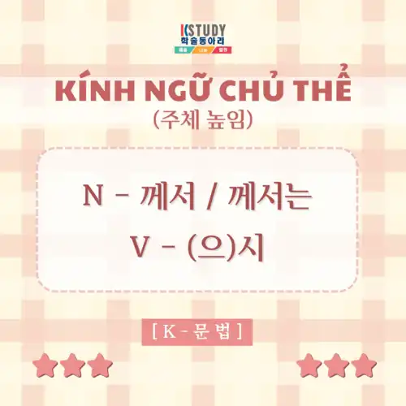
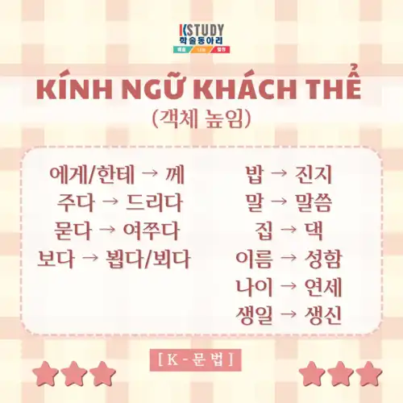
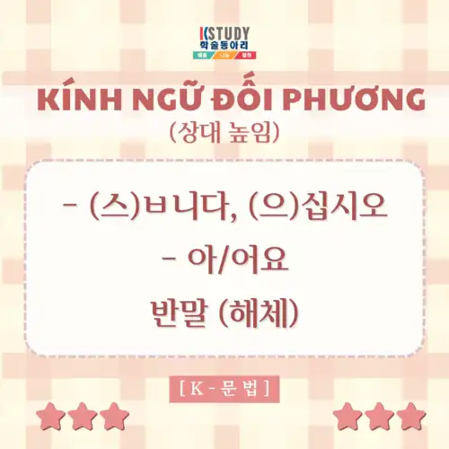

# Kính ngữ trong Tiếng Hàn

Bài viết gốc: [[K-문법] KÍNH NGỮ TRONG TIẾNG HÀN - DÙNG NHƯ THẾ NÀO MỚI ĐÚNG?](https://www.facebook.com/hcmkstudy/posts/1215175093987777/)

안녕하세요 친구들 ~~ Trong quá trình học tiếng Hàn, có lẽ điều khiến nhiều chingu cảm thấy "khó nhằn" nhất chính là các dạng kính ngữ. Nếu các chingu đang cảm thấy "rối não", hoang mang trong vòng xoáy của kính ngữ thì bài viết này chính là dành cho bạn. Vậy thì còn chần chừ gì nữa, hãy cùng K-STUDY khám phá ngay thôi! Let's go!

Nói một cách đơn giản, kính ngữ là hệ thống từ vựng và cách diễn đạt mang sắc thái trang trọng, lịch sự, thường được sử dụng khi giao tiếp với người lớn tuổi, cấp trên hoặc trong những lần gặp gỡ đầu tiên. So với tiếng Việt, hệ thống kính ngữ trong tiếng Hàn phức tạp hơn nhiều và cũng là một trong những nội dung thử thách nhất đối với người học.

Trong tiếng Hàn, có 3 loại kính ngữ là kính ngữ chủ thể (주체 높임), kính ngữ khách thể (객체 높임) và kính ngữ đối phương (상대 높임). Hãy lần lượt tìm hiểu sơ lược từng loại kính ngữ nhé.

## Kính ngữ chủ thể

Kính ngữ chủ thể (주체 높임) là hình thức thể hiện sự tôn kính đối với đối tượng được nói đến trong câu. Lúc này, ta thêm phó từ "께서" hoặc "께서는" vào phía sau danh từ đóng vai trò chủ ngữ trong câu và gắn động từ với (으)시. Trong đó,

- Động từ có patchim + 으시.
- Động từ không có patchim + 시.

{:  style="display: block; margin: 0 auto; max-width:50%; height:auto;" }

### Ví dụ điển hình

1/ 어머니께서 장을 보고 오셔서 맛있는 잡채를 만들어 주셨다.

→ Mẹ tôi đi chợ về và làm cho tôi món Japchae rất ngon.

2/ 우리 아버지께서는 배가 별로 안 나오셨어요.

→ Bố tôi thì bụng không to lắm.

### Lưu ý

- Trong trường hợp đối tượng được nhắc đến có địa vị cao hơn cả người nói và người nghe thì không cần sử dụng (으)시.
- Dù người nói có địa vị thấp hơn chủ thể nhưng trong các chương trình phát thanh, hội nghị hay viết báo,... thì người nói cũng không thể sử dụng kính ngữ chủ thể mà phải dùng thể chung.

## Kính ngữ khách thể

Kính ngữ khách thể (객체 높임) là loại kính ngữ với đối tượng chịu tác động của hành động. Nói một cách đơn giản thì đây là những từ ngữ đóng vai trò làm tân ngữ hoặc bổ ngữ trong câu. Sử dụng trợ từ đặc biệt, như chuyển từ 에게/한테 sang 께 khi chỉ người nhận. Sử dụng các động từ kính ngữ, như 드리다 thay cho 주다, 여쭈다 thay cho 묻다, 뵙다/뵈다 thay cho 보다,...và một số danh từ kính ngữ như:

밥 → 진지: cơm

말 → 말씀: lời nói

집 → 댁: nhà

이름 → 성함: tên

나이 → 연세: tuổi

생일 → 생신: sinh nhật

{:  style="display: block; margin: 0 auto; max-width:50%; height:auto;" }

### Ví dụ điển hình

1/ 어제는 어머니의 생신이 었습니다.

→ Hôm qua là sinh nhật của mẹ tôi.

2/ 과장님께 여쭤 보면 그 사실을 정확히 알 수 있을 거야.

→ Nếu hỏi trưởng phòng thì sẽ biết được chính xác sự thật đó.

## Kính ngữ đối phương

Kính ngữ đối phương (상대 높임) là kính ngữ với người nghe, được thể hiện chủ yếu qua đuôi kết thúc câu. Cụ thể như sau:

- Với mức độ trang trọng cao nhất, người nói dùng -(스)ㅂ니다, (으)십시오, thường xuất hiện trong những tình huống chính thức như phát biểu, bản tin, hay khi nói chuyện với người lần đầu gặp.

- Với mức độ thân mật hơn nhưng vẫn lịch sự, dùng -아/어요, phổ biến trong giao tiếp hằng ngày giữa bạn bè, đồng nghiệp hoặc khi nói với người lớn tuổi nhưng không quá cách biệt về vai vế.

- Trong quan hệ rất thân thiết hoặc với người nhỏ tuổi, người Hàn còn dùng 반말 (해체) -- ví dụ như đuôi -아/어.

{:  style="display: block; margin: 0 auto; max-width:50%; height:auto;" }

### Ví dụ điển hình

1/ 무슨 일이라도 있습니까?

→ Có chuyện gì sao?

2/ 아기가 자고 있어요.

→ Đứa trẻ đang ngủ.

Chà, sau khi đọc đến đây thì K-STUDY tin rằng các chingu đã nắm được điểm khác biệt trong cách sử dụng giữa 3 loại kính ngữ này rồi đúng không nè! Trên đây chỉ là những phần kiến thức căn bản, khái quát về kính ngữ mà chúng ta hay sử dụng nên nếu có chingu nào vẫn còn hứng thú với chủ đề này thì có thể tìm hiểu sâu hơn nữa nha. Còn bây giờ thì K-STUDY xin chào và hẹn gặp lại ở những bài viết thú vị sắp tới nhé! 수고했어요 ^^

Nguồn tham khảo: 경희 한국어 문법 2, 경희 한국어 문법 5.